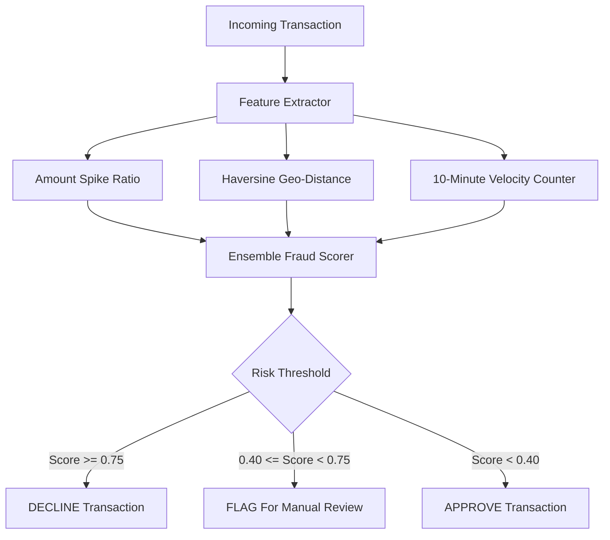

# 💳 FinSentinel Fraud Detection

[](https://opensource.org/licenses/MIT)
[](https://www.python.org/)
[](https://fastapi.tiangolo.com)

Sub-20ms real-time transactional fraud detection microservice combining real-time feature engineering, Haversine geo-distance, velocity tracking, and anomaly scoring.

---

## 🏛️ Scoring Flow



## 🛠️ Usage

```bash
pip install -r requirements.txt
pytest tests/ -v
uvicorn src.api.server:app --port 8000
```

## 📜 License
MIT License. Built by [Shashank Shrivastva](https://github.com/shashankshrivastva-hue).
